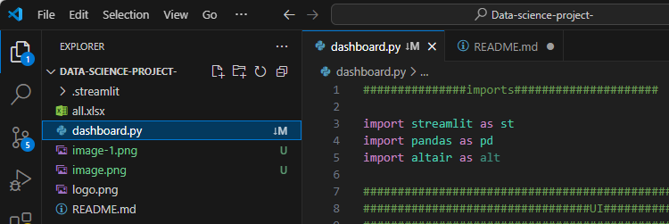
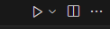
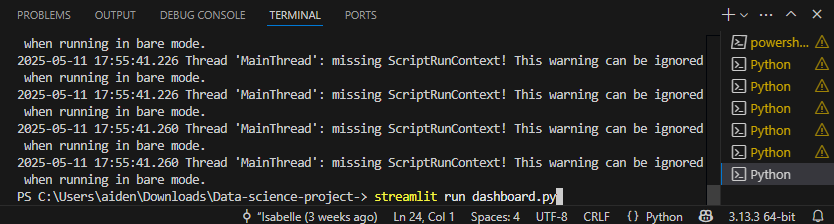
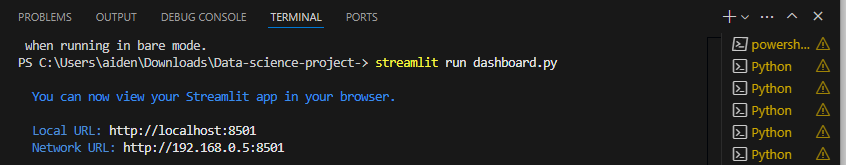
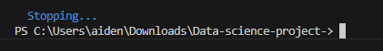

# Data-science-project
group P000151DSUG

computer installations
IDE: visual studio code
https://code.visualstudio.com/

GIT:
https://git-scm.com/

GITHUB: (need to make an account)
https://github.com/

Visual studio code extensions:
to run pyothn we will need these(they should come together under python)
- pylance
- python
- python debugger

videos to help with setup
working with vs(visual studio) code

https://www.youtube.com/watch?v=B-s71n0dHUk&ab_channel=VisualStudioCode

git/ github in vs code

https://www.youtube.com/watch?v=i_23KUAEtUM&t=300s&ab_channel=VisualStudioCode

code operation:
- neccersay installments (copy and paste into terminal, then restart computer)
pip install streamlit
pip install pandas
pip install altair

- to run the code

1,click on dashboard.py

2,click run (triangle top right corner)

3,paste this in terminal: streamlit run dashboard.py

4, press the neter key

5, if i t looks like this it , control click to top link

- to stop the code

go to visual studio codes terminal press: ctrl + c

